# Final exam review
## Computer systems cosc 2p13

## Introduction

+ Top level Components
> CPU connected to the main memory and I/O module using the system bus. The cpu does all the calculations, the main memory holds the data from the current processes and the I/O module is used to get more information which the main memory doesnt have access to ie. secondary memory, user input (keyboard mouse)

+ Memory Hierarchy
>Faster access time, greater cost per bit
>Greater capacity, smaller cost per bit
>Greater capacity, slower access speed
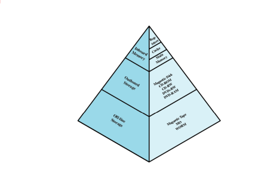
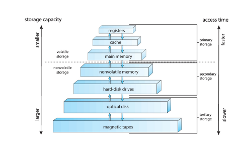
+ Interrupts
> Interrupt the normal sequencing of the processor
> Most I/O devices are slower than the processor
> Processor must pause to wait for device
  - Classes of interrupts
    + **Program:** Generated by some condition that occurs as a result of an instruction execution, such as arithmetic overflow, division by zero, attempt to execute an illegal machine instruction, and refernce outside a user's allowed memory space
    + **Timer:** Generated by a timer within the processor. This allows the operating system to perform certain functions on a regular basis.
    + **I/O:** Generated by an I/O controller, to signal normal completion of an operation or to signal a variety of error conditions.
    + **Hardware failure:** Generated by a failure, such as power failure or memory parity error.
  - Interupt handler
>Program to service a particular I/O device
>Generally part of the operating system

+ Uniprogramming
> Processor must wait for I/O instructions to complete before preceding
> 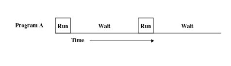
+ Multiprogramming
> When one jobes needs to wait for I/O
> + The processor can switch to another other job
> 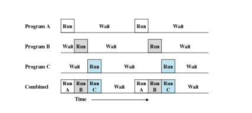
+ Time sharing
> + Using multiprogramming to handle mutliple interactive jobs
> + Processor's time is shared among multiple users
> + Multiple users simultaneously access the system through terminals
> + **Time Slicing** 
>   - Regular time intervals
>   - Preemption -> switch jobs(users)

+ Address space
> + Space in the main memory to hold a program/process
> + Processes address up to 64 bits spaces in main memory 
>   - Processes requiring more than that
>     + Virtual memory

+ System Calls
> + Programmtice method to request a service from the kernel

## Process and Threads

#### Process
+ PCB
> Stands for **P**rocess **C**ontrol **B**lock
> + Contains the process elements
> + Created and manage by operating sysem
> + Allows support for multiple process
> 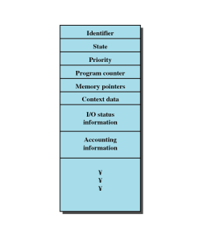
+ Seven-state process model
>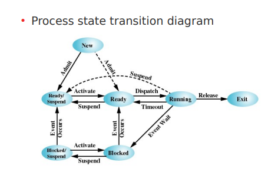
> **supsended** allows the cpu to take out processes out of main memory as it waiting for the I/O to respond with the need information to finish the process
> **Blocked** is where process go when an event/interrupt occurs which doesnt always need to be taken out of the memory as the event might not last long
> **Ready/Running** all programs that are being run is being cycled through ready and running for the cpu to work a little bit then alternate between the processes to make it seem like its doing multiple things simulatinously
+ Time sharing
>

#### Thread
+ Definition
> light-weight process

+ Benefits
> + Light weight
>   - Less time to create a new thread than a process
>   - Less time to terminate a thread than a process
>   - Less time to switch between two threads within the same process
> + Sharing memory and files within same process
>   - Inter-thread communication without invoking the kernel

+ Multithread process model
> Operating system supports multiple threads of execution within a single process
> 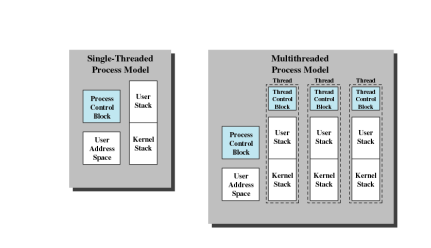
+ Types of threads:
  - user-level
  > * All thread management is done by the application
  > * The kernel is not aware of the existence of threads
  - kernel-level
  > * Kernel maintains context information for the process and the threads
  > * Scheduling is done on a thread basis
  > * Example: Windows
  - combined
  > * Thread creation done in the user space
  > * Bulk of scheduling and synchronization of threads within application
  > * Example: Solaris

+ Race conditions:
> - Two processes want to access shared memory at same time
> - Two or more processes are reading and writing some shared data 
> **To avoid this** kind of situation
>   + Synchronization of process
>   + Mutual exclusion
>     - Preventing more than one process from using the shared memory at the same time

+ Critical Regions:
>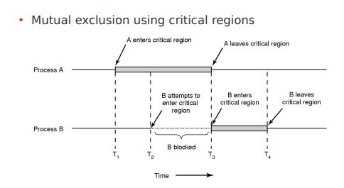

+ Mutual Exclusions:
> Only one proccess can have access to a critical region in main memory

+ Busy Waiting:
> Keep busy in areas that arent in the critical region until it is your turn in the critical region

+ Sleep and wakeup
> process goes to sleep after asking for critical region
> + fatal error: if process is told to wake up before finishing to go to sleep, the process will never wake up

+ semaphore
>  A variable that other threads/processes can read that says the state of the process/thread, used for syncrhonization
> + **Counting** used for showing how many steps into the process the process is
> + **Binary** used for showing if it is ready for a critical region or if just ready to move on

+ Mutex
> short hand for mutual exclusion 

## Memory management

- **Main Memory management**
  + Recolation
  > + Programmer does not know where the program will be placed in memory when it is executed
  > + While the program is executing
  >   - it may be swapped to disk and returned to main memeory at a different location
  >     * Relocated
  > + Memory references must be translated in the code to actual physical memory address

  + Protection
  > + Processes should not be able to reference memory locations in another process without permision
  > + Impossible to check absolute addresses at compile time
  >   - It must be checked only at run-time
  > + memory protection requirement must be satisfied by the processor (hardware) rather than the operating system (software)
  >   - Operating system cannot anticipate all of the memory references a program will make

  + Techniques
    - Fixed partitioning 
    > - Equal size partitions
    >   + any process whose size is less than or equal to the partition size can be loaded into an available partition
    >   + Operating system can swap a process out of partition if all partitions are full
    >  + Program may not fit in a partition
    >  + **causes internal fragmentation**
    > 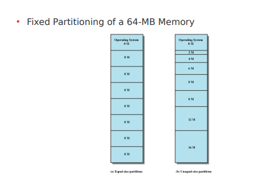
    - Dynamic partitioning
    > + Partitions are of variable length and number
    > + Process is allocated exactly as much memory is required
    > + **External fragmentation** eventually get holes in the memory (inefficiency)
    > 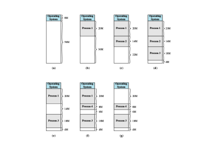
    - Simple paging
    > + fixed and variable-size partitions are inefficient
    >   - internal and external fragmentation
    > + Paging Scheme -> improvement
    >   - Partitioning memory into small equal fixed-size chunks
    >   - Dividing each process into the small size chunks
    >   - Chunks of a process are called pages
    >   - Chunks of memory are called frames
    > + Operating system maintain a **page table** for each process
    > 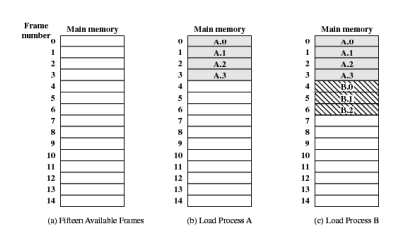
    > + reduces internal fragmentation
    > + avoids external fragmentation
    - Simple segmentation 
    > + all segments of all programs do not have be of the same length
    > + there is a maximum segment length
    > + reduces external fragmentation
    > + avoids internal fragmentation

- **Virtual Memory**
  + Thrashing
  > - Swapping out a piece of a process just before that piece is needed 
  > - The processor spends most of its time swapping pieces rather than executing user instructions
  + Principle of locality
  > - Program and data references within a process tend to cluster
  > - Only a few pieces of a process will be needed over a short period of time
  > - Possible to make intelligent guess about which pieces will be need in the future
  + Strategies
    - Paging
    > + each process has its own page table
    > + each page table entry contains:
    >   - contains the frame number of the corresponding page in main memory
    > + a bit is needed to indicate whether the page is in main memory or not
    > 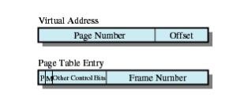
    - Segmentation
    > + May be unequal -> dynamic size
    > + simplifies handling of growing data structures
    > + allows programs to be altered and recompiled independently 
    >   - multiple segments
    > 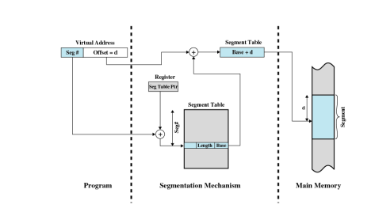
  + Placement policy
  > - it determines where in real memory a process peice is to reside
  > - important in a segmentation system 
  + Replacement policy (caching concept)
  > + page removed should be the page lest likely to be referenced in the near future
  > + most policies predict the future behaviour on the basis of past behaviour

## Process Scheduling in Uniprocessor Systems
- Scheduling in Uniprocessor Systems
  + Turnaround
  > (completion - submission) time
  + Response time
  > request vs response (time)
  + throughput
  > maximum number of processes complete per time
  + fairness
  > to treat processes the same
  > + enforcing policies
  > + balancing resources
  + Cpu utilization
  > the percentage of time the cpu is "working" during a given time
  + Preemptiveness
  > time sharing
  > + running processes may be interupted
  >   - os moves it to the ready state
  >   - downside: more overheads
  > + Better service
  >   - no process can monopolize the processor for very long
  + Scheduling policies
    - FCFS
    > First come first served
    > ie. first in for out (FIFO)
    > 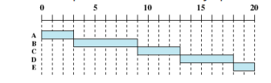
    - Round-Robin
    > Straightforward scheme
    > + preemption
    > + clock interrupt
    > 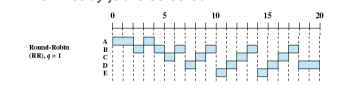
    - Shortest process next
    > to reduce bias in favor of long processes
    > + no time slicing
    > + greedy approach: optimization problems
    > + drawbacks:
    >   - rely on statistics (previous runs)
    > 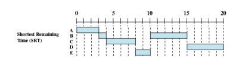
    - Highest response ration next
    > Choose next process with greatest ratio
    > - Ratio → (w + s ) / s
    >   + w → time waiting for processor
    >   + s → expected service time
    > 
    - Feedback
    > + No way to estimate the relative length of a process
    >   - no use of SPN, SRT, HRRN
    > + use of preemption and dynamic priorities
    >   - Multiple queues -> process move down per preemption
    > + Penalizes jobs that have been running longer
    > 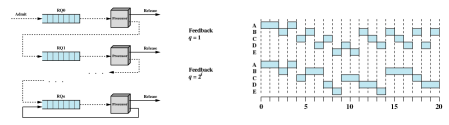

## Deadlocks
- deadlock definition
> A set of processes
> + if each process in the set waits for an event 
> + event can be generated only by another process in the set that is already waiting for another "internal" event
- livelock
> where multiple processes rely on each other to continue so they are running but nothing is getting done
- starvation
> a type of livelock where nothing can start working as multiple processes want the one resource
- Resources
  + Preemptable
  > Taken away from a process with no ill effects
  + nonpreemptable
  > Cannot be taken away 
  >  + as is would cause the process to fail
  + consumable
  > resources are created and destroyed
  > resources are produced and consumed
  > sender/receiver
- 3 + 1 iff conditions for deadlocks
> 1. Mutual exclusion: only one process may use a resource at a time
> 2. Hold and wait : process can hold resources while waiting for more
> 3. No preemption : can't force any resources out of processes
> 4. Circular wait : a close chain of processes exists

> possibility of a deadlock if: 1, 2 and 3
> existence of a deadlock if: 1,2,3 and 4
- dealing with deadlocks
  + ignoring
  > ignoring the problem ie do nothing
  + prevention
  > + disallow one of the 3 deadlock conditions
  > + prevent circular wait
  + avoidance
  > + careful resource allocation
  > + not granting resource request if leading to a deadlock
  + detection
  > periodic deadlock checks

## Input and Output

- Device Controllers
> eletronic component = device controller
> Controller's tasks 
> - To convert serial bit stream to block of bytes
> - To perform error correction as neccesary 
> - To make data available to main memory
- Role of interrupts
>
- Performing I/O
  + Programmed I/O
  > simplest way
  > - ties up CPU full time with I/O operations
  > - CPU busy waiting 
  >   + okay for embedded systems
  >   + not ok for more complex systems
  > 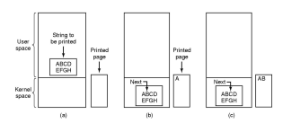
  + Interrupt-driven I/O
  >
  + Direct Memory Access (DMA)
  >

+ Buffering
>
+ Spooling
>

+ Disk scheduling
  - performance
  >
  >  + Seektime
    >
  >  + Arm scheduling algorithms
    >

## File Systems

+ File Organization
>
+ File record organization
>

+ Secondary storage management
  - File allocation
  >

## Networking

+ End to end communication
  - loss
  >
  - delay 
  >
  - throughput
  >
+ Protocol layers
>
+ Application layer
>
+ Transport layer -> ports
>
- - TCP
  >
  - UDP
  >
  - Acknowledgements
  >

+ Flow
>
+ congestions
>
+ window
>

+ Networking layers - Datagrams
> 
- - Functions
  >
  - IP addressing
  >
  - Routing alorithms
  >
  - Hierarchical routing
  >
+ Link layer -> frames
>
- + Mac protocols
  >
  + TDMA
  >
  + FDMA
  > 
  + CSMA
  >
  + Adress resolution protocol (ARP)
  >
  + Switches vs routers
  >

## Multiple processor systems

+ types of MPS
  - Loosely coupled
  >
  - specialized processors
  >
  - tightly coupled
  >
+ Parallelism granularity
>
+ Scheduling
>
+ - Assignment
  >
  - multiprogramming
  >
  - dispatching
  >
  - thread scheduling in MPS
  >

## Real-time Systems

+ Definition of real- time systems
>

+ features of real-time systems
> 
+ Classification
  + Hard
  >
  + Soft
  >
  + Aperiodic
  >
  + period
  >
+ Scheduling 
  - Classification
  >
  - Approaches
  >
+ Rate monotonic scheduling 
>
+ Priority inversion
>

## Distributed Systems
+ Difference between fat vs. thin clients
>
+ caching
>

+ middleware
  - classification
    + blocking vs nonblocking
    >
    + reliable vs unreliable
    >
  - Types
    + Message passing
    >
    + RPC
    >
    + Object-oriented
    >

## Distributed System Management

- process migration
  + Motivation
  >
  + freezing a process and pending messages
  >
- distributed global states
>
- - Distributed snapshot algorithm
  > 

- Distributed mutual exclusion
>
- + lamport algorithm
  >
  + mutual exclusion algorithm
  >

+ distributed deadlock detection
>

## Virtualization

+ Hypervisors
>
+ Reasons for virtualization
>
+ - consolidation ratio
  >
+ Paravirtualization
>
+ containers
>

## Cloud computing 
- definition -> elastic, on-demand, anywhere/anytime
>
- service models
>
- deployment models
>
- cloud OS
>

## Security
- CIA Triad
>
- Types of threats (Interruption, Interception, modification, fabrication)
> 
- Computer System Assets
>
- Access control
>