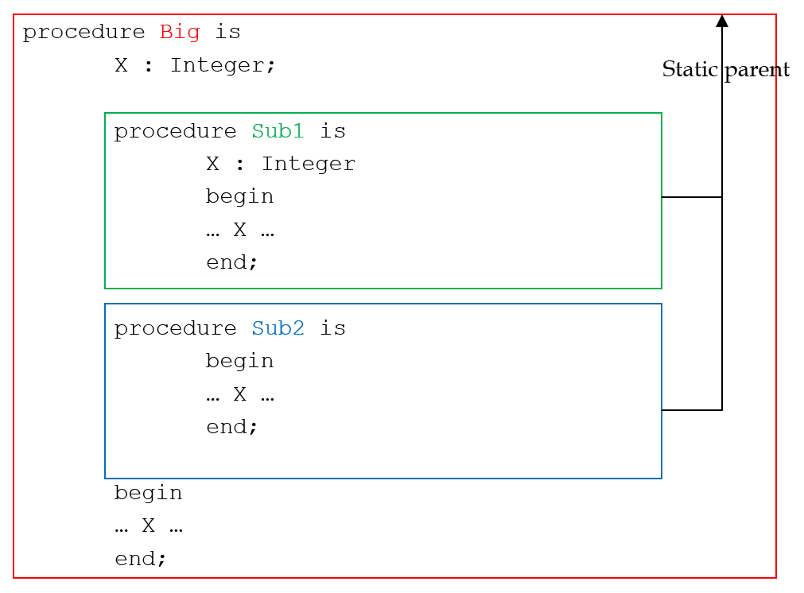
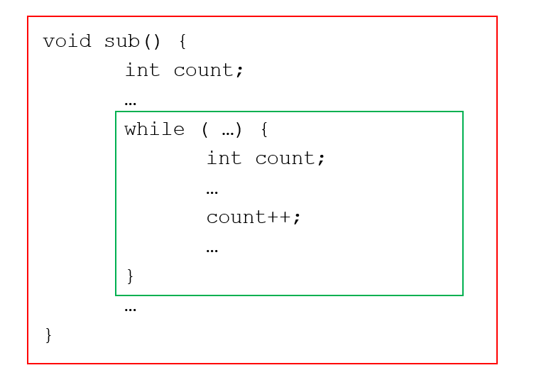

## Scope
+ Static Scope
  - Method of binding names to nonlocal variables introduced in algol 60
  - Can be determioned statically(hence the name) ie prior to execution
  -  Permits to determine the type of every variable 
  - Two categories of static-scoped languages:
    + Those in which subprogram can be nested 
      - Creates static scope in subprograms
      - Ada, Javascript, Fortran 2003, PHP
    + Those in which subprograms cannot be nested
      - Any C-Based language
      

## Blocks 
+ Many languages allow new static scopes to be defined in the midst of executable code via blocks

## Dynamic Scope
+ Based on the calling sequence of subprograms
+ Can Only be determined at run time
+ Used in APL, SNOBOL, early LIPS